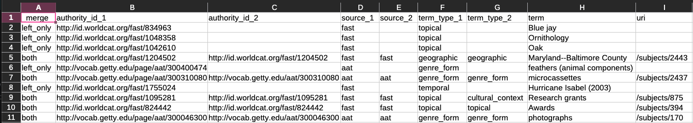

# Matching script

??? note "Note"
    To best explain this process, we are going to go through the matching workflow for subjects but there are no differences for persons, families, or corporate entities.

## Preparation
Place a copy of your template CSV (`subject-template.csv`) and your script export CSV (`allSubjects.csv`) in the folder `helping-scripts` in your repository.

## Running the script

Determine which column in each spreadsheet contain the name of entity. In our example, the name of the subject is in a column called `term` for `subject-template.csv` and in a column called `title` for `allSubjects.csv`. We want these two column to match, so we are going to quickly rename `title` with `term` in `allSubjects.csv` and save.

After that, we will run the script [`matchingNames.py`](https://github.com/mjanowiecki/archivesspace-collection-ingest/blob/main/helping-scripts/matchingNames.py). Open your terminal and `cd` into the `helping-scripts` folder and type the following. 

```
python matchingNames.py -f subject-template.csv -f2 allSubjects.csv -c term

```

In the command, `-f` will always be your template spreadsheet and `-f2` will always be your export spreadsheet, while `-c` will be the name of your shared column header. Type the entire name of the spreadsheets, including any datetime stamp.

## Reviewing results

The script should produce a new CSV called `subject-template-matches.csv` which is a copy of your `subject-template.csv` with rows from `allSubjects.csv` inserted if the names matched. Reviewing this, any row without additional information did not match an existing entity, but rows with additional information from `allSubjects.csv` did match based on names. You can also look at the column `_merge` to determine which entities already exist - `left_only` means a match was not found while `both` means a match was found.

{ align=left }

Ad this point, we also recommend briefly visually reviewing both original spreadsheet to see if any matches with slight spelling differences were missed (like `Cat` and `Cats`) and manually correcting them if so.

If any subjects matched (aka already exist), delete their rows from `subject-template.csv` and add their names and URIs to `alreadyExistingEntities.csv`. This should leave you with a `subject-template.csv` that only contains new subjects.
