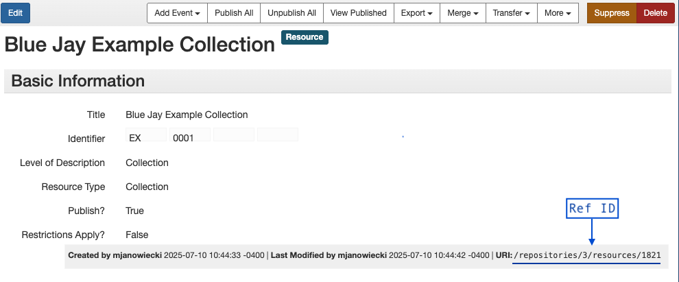
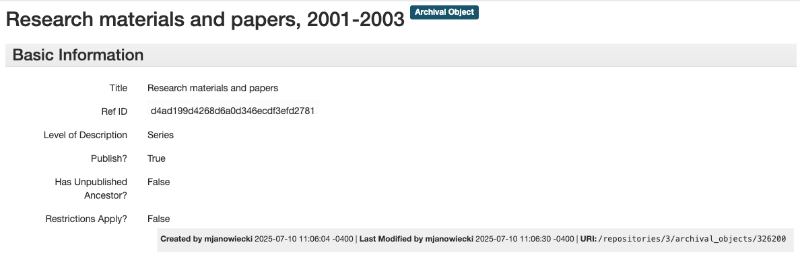

# Create new collection in ArchivesSpace

For users familiar with ArchivesSpace, this step should be straightforward. Go to the Staff interface of ArchivesSpace and manually create a collection resource. Record the `Ref ID` in relevant templates.

In the example below, our `Ref ID` is `/repositories/3/resources/1821`.

{ align=left }
 

# Create new top-level series in ArchivesSpace

If your collection includes series, you can also create them manually at this point. While they can be included in your archival objects template, manually creating series may make the process easier. Record their `Ref IDs` in the `parent` column of your archival object template. 

In our example collection, we have three series with the following `Ref IDs`.

- Research materials and papers, 2001-2003: `/repositories/3/archival_objects/326200`
- Correspondence, 2002-2003: `/repositories/3/archival_objects/326201`
- Financial records, 2001-2003: `/repositories/3/archival_objects/326202`

{ align=left }  
