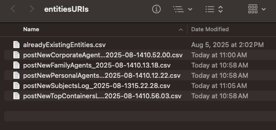

# Update archival object template with URIs

While there are numerous methods you could use to replace entity names with URIs in the `archival-object-template.csv`, we have a script available that does this automatically using spreadsheets you already have. To do this method, see the steps below.

# Run [`findAndReplaceStringsWithURIs.py`](https://github.com/mjanowiecki/archivesspace-collection-ingest/blob/main/helping-scripts/findAndReplaceStringsWithURIs.py)

## Preparation

1. Create a new folder somewhere on your computer. In this example, I created a folder called `entitiesURIs` on my Desktop.
2. Put all of your log CSV files for agents and subjects in the new folder. 
3. Find your `alreadyExistingEntities.csv` and also add it to the folder.
4. Put a copy of your archival-object-template in your `helping-scripts` folder.

{ align=left }

## Running the script

1. In your terminal, navigate to your `helping-scripts` folder.
2. Run the following command in your terminal, adjusting the filename and directory path to match what you have.

```
python findAndReplaceStringsWithURIs.py -f archival-object-copy.csv -d /Users/michelle/Desktop/entitiesURIs
```

## Reviewing your results

A new spreadsheet beginning with `wReplacements_` should have been created in your `helping-script` folder. This is a copy of your archival-object-template with all names replaced with their URIs. I'd recommend visually scanning the relevant columns (`linked_agents`, `subjects`, `instances`) to make sure no strings or barcodes remain. Once verified, this spreadsheet should be the one used in step 8.
